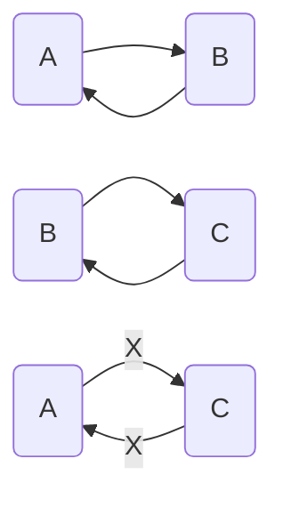

---

title: Zotero的基本使用

date: 2023-8-06 23:33:25

author: JunDecNo

summary: 帮助了解Zotero的基本使用

tags: 

 - Zotero

 - 工具使用

 - 基本使用

categories: 工具使用

img: https://s2.loli.net/2023/11/06/63axjsoVeYlw4PJ.png

---

## 一、收集题录

### 1、通过浏览器插件进行保存题录

先点击插件会自动搜索网页中的题录，之后就可以进行保存了。单个文件显示学士帽的图标

> 如果弹出一些错误，可以在zotero的官方网站注册一下，并且在zotero里设置同步，就可以解决

>

> 同时插件可以手机pdf文档，因为没有使用学校ip登录所以没有出现pdf文档

**image-20220730000636092**

> 可以看到zotero方便的提供了很多功能

### 2、通过标识符添加题录

支持==ISBN、DOI、PMID、arXiv ID、ADS==

> 同时也可能找不到对应的pdf，可以双击条目会在浏览器中打开对应的网站

### 3、拖拽文件实现

将下载好的pdf文献直接拖拽到窗口即可自动提取论文的详细信息等

### 4、通过剪贴板实现

> 就可以实现导入条目的功能，但是这种方法没有导入pdf，需要另外添加pdf

同时可以批量导入，多选论文，点击RefWorks导出即可

另外可以手动添加，但是一般不适用

## 二、管理题录

### 1、分类

`shift+鼠标左键`来移动条目或文件夹

`鼠标左键`则相当于在新的目录下复制的条目

`Ctrl`高亮文件夹所在目录

### 2、查重

在重复条目中显示出来，可以进行合并

**image-20220730003813104**

### 3、关联

点击文献后可以在右侧选择关联文献，关联文献是相互的，

mermaid

但是关联没有传递性，即只能相互关联，A不会关联到C

### 4、标签

可以对相应的文献设置标签，方便管理，往往在同一个目录下使用。通过标签可以设置颜色，当点击标签时就会显示在对应的文献上

> 可以非常快捷的看到含有标签的文献

>

> 在导入文献的时候就会根据关键词来添加标签，同时可以在首选项中关闭

### 5、笔记

zotero可以记笔记，同时在内置的pdf阅读器中可以高亮文本等一些基础的功能

> zotero同时可以导出笔记，使用笔记管理软件管理

### 6、RSS订阅功能

可以自动抓取文章

自动抓取的结果

### 7、快捷键的使用

快捷键

功能

鼠标左键拖动

复制文献到新目录

Shift+鼠标左键拖动

移动文献到新目录

Ctrl

高亮所在目录

Ctrl+Shift+alt+I

从剪贴板导入

Ctrl+T

切换翻译前后标题

+

展开目录

-

折叠目录

## 四、在论文中插入引文

### 1、添加引文

> 在安装zotero后会在word中自动安装一个插件，这就是用来探入引文的

可以看到并没有中文文献常用的GP/T 7714-2015的样式，可以点击管理样式添加样式，搜索7714，选择加入即可

之后会出现zotero的搜索框，输入对应文献信息，也可以使用经典视图加入

**插入多篇文献**

使用经典视图，选择多重来源

> 修改引文时，直接选择引文选择`Add/Edit Citation`进行修改

>

> 使用`unlink citations`取消引文链接，只保留文本信息

**完成！**

## 五、插件

### 插件安装

> 同时也可以直接拖拽

### Jasminum(茉莉花)插件

-   拆分或合并 Zotero 中条目作者姓和名

-   根据知网上下载的文献文件来抓取引用信息（就是根据文件名）

-   添加中文PDF/CAJ时，自动拉取知网数据，该功能默认关闭。需要到设置中开启，注意添加的文件名需要含有中文，全英文没有效果（还是根据文件名）

-   为知网的学位论文 PDF 添加书签

-   更新中文 translators

-   拉取文献引用次数，是否核心期刊

[下载地址](https://github.com/l0o0/jasminum)

### zotero-pdf-translate

-   翻译条目标题

-   翻译段落

-   单词的词典功能

-   选中文本，高亮注释，注释中会自动加入翻译内容

-   多种翻译引擎可选

-   多种语言可翻译

[下载地址](https://github.com/windingwind/zotero-pdf-translate)

### zotero-style

### zotero reference

